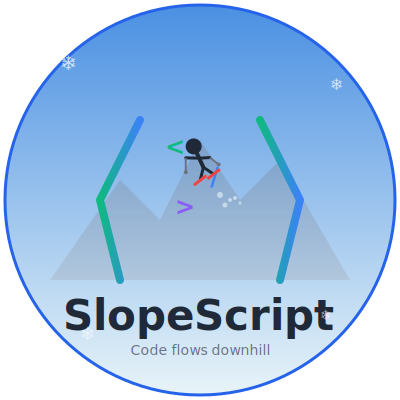

<p align="center">
  
</p>

# 🎿 SlopeScript

A skiing-themed programming language where code flows downhill like a skier on a mountain!

```
summit
  carve "Shred the gnar! 🏔️"
lodge
```

## 🏔️ Installation

### Requirements
- Python 3.7 or higher

### Quick Start

1. Clone this repository:
```bash
git clone https://github.com/yourusername/slopescript.git
cd slopescript
```

2. Make the interpreter executable (optional):
```bash
chmod +x slopescript.py
```

3. Run your first program:
```bash
python slopescript.py examples/hello.slope
```

## 📚 Language Guide

### Basic Structure

Every SlopeScript program starts at the `summit` and ends at the `lodge`:

```
summit
  // Your code flows downhill here
lodge
```

### Variables (Gear)

Pack your variables like gear for a ski trip:

```
pack speed = 45
pack name = "Tony"
pack isReady = powder  // powder = true, ice = false
```

### Output (Carve)

Carve your output into the snow:

```
carve "Hello, skier!"
carve speed
```

### Input (Chairlift)

Get user input via the chairlift:

```
pack name = chairlift("What's your name?")
carve "Welcome,"
carve name
```

### Conditionals (Trail Ratings)

Choose your path based on conditions:

```
pack speed = 35

greenCircle (speed < 20)
  carve "Taking it easy!"
blueSquare (speed < 40)
  carve "Nice cruising speed"
blackDiamond
  carve "You're flying!"
```

- `greenCircle` = if statement (beginner trail)
- `blueSquare` = else if statement (intermediate trail)
- `blackDiamond` = else statement (expert terrain)

### Loops

**Gondola** (while loop):
```
pack laps = 0

gondola (laps < 5)
  carve "Lap"
  carve laps
  pack laps = laps + 1
gondola
```

**Liftline** (for-each loop):
```
pack skiers = ["Alice", "Bob", "Charlie"]

liftline skier in skiers
  carve skier
  carve "is dropping in!"
liftline
```

### Arrays (Ski Racks)

```
pack trails = ["Corbet's", "KT-22", "Delirium Dive"]
carve trails[0]  // Corbet's

pack scores = [95, 87, 92]
carve scores[1]  // 87
```

### Comments

```
// Single line comment - like a pole mark in snow

/* Multi-line comment
   Like tracks across
   fresh powder */
```

### Control Flow

```
// Break out of a loop
bail

// Continue to next iteration
sendIt
```

### Operators

**Arithmetic:**
- `+` addition
- `-` subtraction  
- `*` multiplication
- `/` division

**Comparison:**
- `<` less than (gentler slope)
- `>` greater than (steeper slope)
- `==` equal to
- `!=` not equal to
- `<=` less than or equal
- `>=` greater than or equal

**Logical:**
- `&&` and (parallel - both true)
- `||` or (moguls - either true)
- `!` not (wipeout)

**Boolean Values:**
- `powder` = true
- `ice` = false

## 🎯 Example Programs

Check out the `examples/` folder for sample programs:

- `hello.slope` - Classic Hello World
- `counter.slope` - Simple counting loop
- `ski_day.slope` - Simulates a day on the slopes
- `guess_number.slope` - Interactive guessing game
- `vertical_tracker.slope` - Tracks vertical feet skied
- `conditions_check.slope` - Checks mountain conditions
- `speed_calculator.slope` - Calculates skiing speed
- `trail_selector.slope` - Interactive trail selector

## 🚀 Running Programs

```bash
python slopescript.py <filename.slope>
```

Or make it executable:
```bash
./slopescript.py <filename.slope>
```

## 📖 Full Language Specification

For complete language documentation, see [LANGUAGE_SPEC.md](LANGUAGE_SPEC.md)

## 🛠️ Current Features

- ✅ Variables and assignment
- ✅ Arithmetic operations
- ✅ Comparison and logical operators
- ✅ Conditionals (if/else if/else)
- ✅ While loops
- ✅ For-each loops
- ✅ Arrays and indexing
- ✅ User input
- ✅ Comments
- ✅ Break and continue

## 🚧 Planned Features

- [ ] Functions (tricks)
- [ ] Error handling (ski patrol)
- [ ] Hash maps/objects (lockers)
- [ ] String operations
- [ ] File I/O
- [ ] Standard library

## 🤝 Contributing

Contributions are welcome! Feel free to:

- Add new features
- Fix bugs
- Improve documentation
- Create example programs
- Suggest language improvements

Please open an issue or pull request on GitHub.

## 📄 License

MIT License - See LICENSE file for details

## 🎿 Philosophy

SlopeScript embraces the flow and rhythm of skiing. Code should read like planning and executing ski runs - starting at the top, making decisions on the fly, and finishing with style at the bottom!

## 💡 Examples

### Hello World
```
summit
  carve "🎿 Hello, World!"
lodge
```

### Calculate Vertical Feet
```
summit
  pack runsCompleted = 0
  pack totalVertical = 0
  pack maxRuns = 5
  
  gondola (runsCompleted < maxRuns)
    pack runsCompleted = runsCompleted + 1
    pack thisRun = 2500
    pack totalVertical = totalVertical + thisRun
    
    carve "Run #"
    carve runsCompleted
    carve "- Dropped"
    carve thisRun
    carve "feet!"
  gondola
  
  carve "Session complete! Total vertical:"
  carve totalVertical
  carve "feet!"
lodge
```

### Interactive Name Greeter
```
summit
  pack name = chairlift("What's your name, skier?")
  carve "Welcome to the mountain,"
  carve name
  carve "! Let's shred! 🎿"
lodge
```

---

**"There are no friends on a powder day... but there are variables!"** 🎿❄️

Made with ❤️ for skiers who code (and coders who ski)