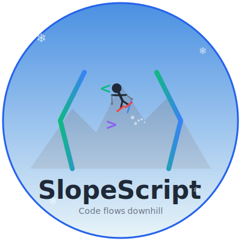

<p align="center">
  
</p>

<h1 align="center">🎿 SlopeScript</h1>

<p align="center">
  <b>A programming language where code flows downhill.</b><br>
  Real functions, real data structures, real error handling — with fresh powder on top.
</p>

<p align="center">
  
  
  
  
</p>

```slopescript
summit
  trick fibonacci(n)
    greenCircle (n < 2)
      stomp n
    runout
    stomp fibonacci(n - 1) + fibonacci(n - 2)
  nail

  liftline i in laps(10)
    carve "fib({i}) = {fibonacci(i)}"
  runout
lodge
```

## 🌐 Try it in your browser

The **[SlopeScript Playground](playground/index.html)** runs the real
interpreter in your browser via WebAssembly — no install, nothing sent to a
server. Pick an example, edit it, hit Run, and share your program as a link.
Enable GitHub Pages for this repo (Settings → Pages → Source: *GitHub
Actions*) and the playground deploys automatically to
`https://<your-user>.github.io/slopescript/`.

Every program starts at the **summit** and ends at the **lodge**. In between you
pack gear (variables), carve output into the snow, ride gondolas (while loops)
and liftlines (for loops), land tricks (functions), and when things go wrong,
ski patrol (error handling) has your back.

SlopeScript is a real, working language: first-class functions with recursion,
arrays and dictionaries, a 50-function standard library (including HTTP and
file I/O), precise error messages
with line numbers, an interactive REPL, and a zero-dependency single-file
interpreter.

## 🏔️ Installation

Requires Python 3.8+. No dependencies.

```bash
git clone https://github.com/arnavj/slopescript.git
cd slopescript
pip install .
```

That gives you the `slope` command:

```bash
slope examples/hello.slope   # run a program
slope                        # interactive REPL
slope --version
```

No pip? The interpreter is a single file — just run it directly:

```bash
python3 slopescript.py examples/hello.slope
```

## ⛷️ The 60-second tour

### Variables — pack your gear

```slopescript
summit
  pack speed = 45
  pack name = "Tony"
  pack isReady = powder      // powder = true, ice = false
  pack nothing = whiteout    // whiteout = null

  speed += 5                 // +=, -=, *=, /= all work
  carve "Hi", name, "- speed is", speed
lodge
```

### Output & input — carve and ride the chairlift

```slopescript
carve "Hello, skier!"                 // print (multiple values, comma-separated)
carve "You did {runs} runs — {runs * 2500} feet!"   // {…} interpolates any expression
pack answer = chairlift("Your name?") // prompt for input
pack age = number(chairlift("Age?"))  // convert text to a number
```

### Conditionals — pick your trail

Rated like real trails: `greenCircle` (if), `blueSquare` (else if),
`blackDiamond` (else). Every block ends at the `runout` — the flat bit at the
bottom of a slope.

```slopescript
greenCircle (speed < 20)
  carve "Cruising the bunny slope"
blueSquare (speed < 40)
  carve "Solid blue-square pace"
blackDiamond
  carve "Absolutely sending it 💨"
runout
```

### Loops — gondolas and liftlines

```slopescript
// gondola = while loop
pack laps = 0
gondola (laps < 5)
  laps += 1
  carve "Lap", laps
runout

// liftline = for-each loop (racks, text, lockers, or laps(n) for counting)
liftline skier in ["Alice", "Bob", "Charlie"]
  carve skier, "drops in!"
runout

liftline i in laps(3)      // 0, 1, 2
  carve i
runout
```

`bail` breaks out of a loop; `sendIt` continues to the next iteration.

### Tricks — functions

```slopescript
trick verticalPerRun(total, runs)
  greenCircle (runs == 0)
    stomp 0                 // stomp = return (stomp the landing!)
  runout
  stomp round(total / runs)
nail                        // nail finishes the trick

carve verticalPerRun(24000, 9), "feet per run"
```

Tricks are proper, **first-class** functions — recursion, closures, and all.
Pass them around, stash them in lockers, or write them inline:

```slopescript
pack runs = [2500, 3100, 1800, 2900]
carve filter(runs, trick(feet) stomp feet > 2400 runout)   // [2500, 3100, 2900]
carve map(runs, trick(feet) stomp feet / 3.28 runout)      // feet → meters
carve reduce(runs, trick(a, b) stomp a + b runout)         // day total
```

### Modules — traverse to another trail

```slopescript
traverse "lib/slopemath.slope"   // load another file's tricks and gear
carve gradient(900, 2800)
```

Each file loads once (repeat traverses are no-ops) and cycles are caught.

### Files — the trail journal

```slopescript
writeFile("journal.txt", "TRAIL JOURNAL\n")
appendFile("journal.txt", "KT-22: 3000 feet\n")
liftline line in readLines("journal.txt")
  carve line
runout
```

`readFile`, `readLines`, `writeFile`, `appendFile`, `fileExists`,
`deleteFile` — and every failure is catchable by ski patrol.

### The radio — call real APIs over HTTP

```slopescript
patrol                                    // mountains have dead zones
  pack repo = radioJson("https://api.github.com/repos/python/cpython")
  carve "{repo.full_name} has {repo.stargazers_count} stars"
  radioPost("https://example.com/report", { trail: "KT-22", open: powder })
patroller (e)
  carve "No signal:", e
runout
```

`radioBase(url)` GETs text, `radioJson(url)` GETs and parses JSON,
`radioPost(url, value)` POSTs (lockers/racks go as JSON), plus
`parseJson` / `toJson`. Aliases: `fetch`, `fetchJson`, `post`. GET works in
the browser playground too (subject to CORS).

### Racks & lockers — arrays and dictionaries

```slopescript
pack trails = ["Corbet's", "KT-22", "Delirium Dive"]
carve trails[0], "of", length(trails)
push(trails, "Rambo")
trails[1] = "Chute 75"

pack lift = { name: "Big Red", capacity: 6, express: powder }
carve lift.name             // dot access
carve lift["capacity"]      // or bracket access
lift.express = ice          // assign either way
carve keys(lift), values(lift)
```

### Ski patrol — error handling

```slopescript
patrol                                  // try
  pack n = number(chairlift("Number?"))
  greenCircle (n < 0)
    avalanche "no negative numbers!"    // throw (any value, even a locker)
  runout
  carve 100 / n
patroller (whoops)                      // catch
  carve "⛑️ Patrol caught it:", whoops
runout
```

Uncaught problems produce friendly reports with the file and line:

```
⛑️  Ski Patrol Report (run.slope, line 7): Yard sale! Division by zero
```

## 🛖 The Base Lodge (standard library)

Around 50 built-in functions, no imports needed. Highlights:

| Category | Functions |
|---|---|
| I/O | `chairlift(prompt)` |
| Convert | `number(x)`, `text(x)`, `type(x)` |
| Racks | `length`, `push`, `pop`, `laps(n)`, `groom` (sort), `flip` (reverse), `contains`, `find`, `slice`, `join`, `sum`, `min`, `max` |
| Higher-order | `map`, `filter`, `reduce`, `each` |
| Text | `upper`, `lower`, `trim`, `split`, `replace`, `startsWith`, `endsWith` |
| Lockers | `keys`, `values`, `has`, `drop` |
| Files | `readFile`, `readLines`, `writeFile`, `appendFile`, `fileExists`, `deleteFile` |
| Radio (HTTP) | `radioBase` (fetch), `radioJson`, `radioPost`, `parseJson`, `toJson` |
| Math | `abs`, `round`, `basin` (floor), `cornice` (ceil), `sqrt`, `snowflake` (random) |
| Misc | `clock()` |

Familiar aliases work too: `range`, `sort`, `reverse`, `floor`, `ceil`, `random`.
Full reference in [LANGUAGE_SPEC.md](LANGUAGE_SPEC.md).

## 🎮 REPL

```
$ slope
🏔️  SlopeScript 2.0.0 — fresh corduroy, no waiting.

⛷️  pack x = 21
⛷️  x * 2
42
⛷️  trick double(n)
···   stomp n * 2
··· nail
⛷️  double(1200)
2400
⛷️  apres
🌙 Last run of the day. See you at first chair!
```

Expressions echo their value, blocks stay open across lines until you close
them, and state persists for the whole session.

## 🎯 Examples

Every program in [`examples/`](examples/) runs out of the box:

| Program | Shows off |
|---|---|
| [`hello.slope`](examples/hello.slope) | The classic |
| [`counter.slope`](examples/counter.slope) | Gondola loops |
| [`ski_day.slope`](examples/ski_day.slope) | Loops + trail ratings together |
| [`tricks.slope`](examples/tricks.slope) | Functions, returns, recursion |
| [`higher_order.slope`](examples/higher_order.slope) | map/filter/reduce, closures, anonymous tricks |
| [`mountain_tour.slope`](examples/mountain_tour.slope) | Modules with `traverse` |
| [`trail_journal.slope`](examples/trail_journal.slope) | File I/O |
| [`radio_check.slope`](examples/radio_check.slope) | HTTP + JSON against a real API |
| [`lodge_menu.slope`](examples/lodge_menu.slope) | Lockers (dictionaries) |
| [`ski_patrol.slope`](examples/ski_patrol.slope) | Error handling |
| [`vertical_tracker.slope`](examples/vertical_tracker.slope) | Racks of lockers |
| [`guess_number.slope`](examples/guess_number.slope) | Input, random numbers, patrol |
| [`trail_selector.slope`](examples/trail_selector.slope) | Lockers as lookup tables |
| [`speed_calculator.slope`](examples/speed_calculator.slope) | Math builtins |
| [`conditions_check.slope`](examples/conditions_check.slope) | Logical operators |

## 🗺️ Cheat sheet

| SlopeScript | Means | SlopeScript | Means |
|---|---|---|---|
| `summit` / `lodge` | program start / end | `trick` / `nail` | define function |
| `pack x = 1` | declare variable | `stomp v` | return |
| `carve a, b` | print | `patrol` / `patroller` | try / catch |
| `chairlift(p)` | input | `avalanche v` | throw |
| `greenCircle` | if | `bail` | break |
| `blueSquare` | else if | `sendIt` | continue |
| `blackDiamond` | else | `powder` / `ice` | true / false |
| `gondola` | while | `whiteout` | null |
| `liftline x in r` | for-each | `runout` | end of block |
| `traverse "f"` | import a file | `"x is {expr}"` | interpolation |

## 🧭 Why SlopeScript?

Learning-to-code tools tend to be either toys (fun, but you outgrow them in a
week and none of it transfers) or real languages (transferable, but the first
error message sends you to Stack Overflow). SlopeScript sits deliberately in
the gap:

- **It's a real language** — first-class functions, closures, data
  structures, modules, error handling. Every concept transfers 1:1 to
  Python or JavaScript.
- **It's genuinely friendly** — errors name the line and tell you how to
  fix it, the whole language fits on one cheat sheet, and the metaphor does
  real pedagogical work (`patrol` catches wipeouts; blocks end at the
  `runout`; a `traverse` loop is an error because two trails can't lead to
  each other).
- **Zero setup at every stage** — playground in the browser, then one
  single-file interpreter, then `pip install`. No toolchain cliff.
- **It has a home crowd** — ski towns, ski clubs, and STEM programs get an
  on-theme way in. Nobody's excited to demo generic pseudo-code on the
  lodge projector; a guess-the-number game called *guess the snow depth* is
  a different story.

## 🧪 Development

```bash
python3 -m unittest discover tests    # run the test suite (126 tests)
```

The whole language lives in [`slopescript.py`](slopescript.py) — lexer, parser,
interpreter, standard library, REPL, and CLI. Read it top to bottom in one
sitting; it's a nice little tour of how languages work.

Contributions welcome — see [CONTRIBUTING.md](CONTRIBUTING.md).

## 📄 License

MIT — see [LICENSE](LICENSE).

---

**"There are no friends on a powder day... but there are variables!"** 🎿❄️

Made with ❤️ for skiers who code (and coders who ski)
